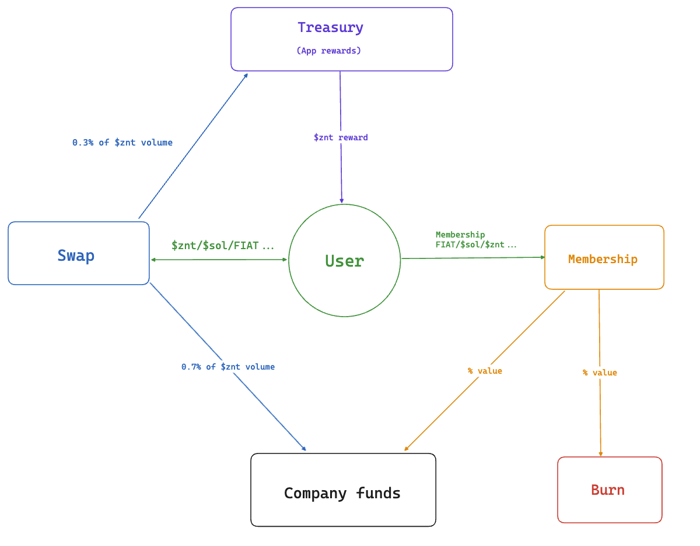

# Business model

Zentt is a mobile app that aims to create a rewarding ecosystem for our users, allowing them to engage with our app and earn rewards in the form of $ZNT, our proprietary digital currency.&#x20;

**Earning and Using $ZNT**

Upon joining Zentt, users have the ability to use the app completely free of charge. Through engagement and participation users are rewarded with $ZNT. \
\
At first $znt holders will be able to use it for:

* **Currency Exchange:** Users can exchange $ZNT for other digital currencies or convert it into fiat money, offering flexibility in how rewards are utilized.
* **Membership Purchase:** $ZNT can be directly used to purchase a membership,  providing users with exclusive benefits.

**Membership Benefits**

Purchasing a membership, whether through $ZNT, fiat money, or other digital tokens like $SOL, elevates the user experience significantly. Membership unlocks:

* **Enhanced Utilities:** Members gain access to features that enhance their interaction with the app.
* **Extra Missions and Achievements:** Exclusive missions and unique achievements are available to members, adding depth to the user experience.
* **Unique Titles and Rewards:** Members can earn titles and rewards that distinguish them within the Zentt community.

**Path to Membership**

For users starting out and don't want to invest in a membership, accumulating enough $ZNT to purchase a membership is a journey that spans 3 seasons. This pathway ensures that even free users have the opportunity to experience the full benefits of Zentt with dedication and engagement.

**Economic Model**

The economic foundation of Zentt is designed to be sustainable and beneficial for both the company and its users:

* **Revenue Sharing:** A portion of each membership purchase is allocated to the company’s cash reserve, supporting the operational and developmental needs of Zentt.
* **$ZNT Burn Mechanism:** Another part of the membership fee is used to burn $ZNT, a process that helps in regulating the currency's supply and value.
* **Treasury and Cash Reserve Replenishment:** Transaction fees are implemented as follows:
  * 0.3% of all $ZNT transactions are redirected to replenish the app's treasury, ensuring a continuous flow of rewards and operational sustainability.
  * 0.7% of all $ZNT transactions contribute to the company's cash reserve, supporting financial health and enabling future growth.

<figure><figcaption>
Diagram of $znt tokenomics
</figcaption></figure>

